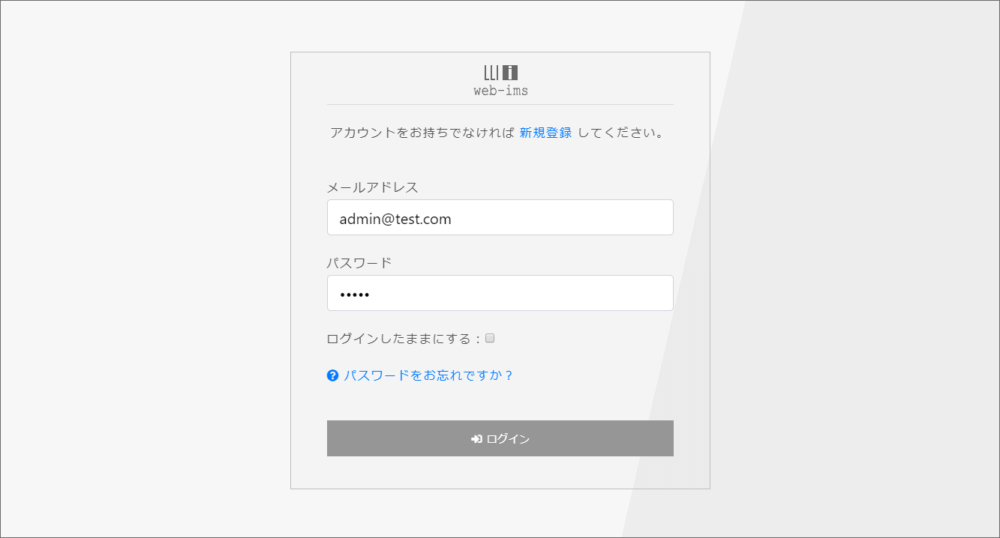
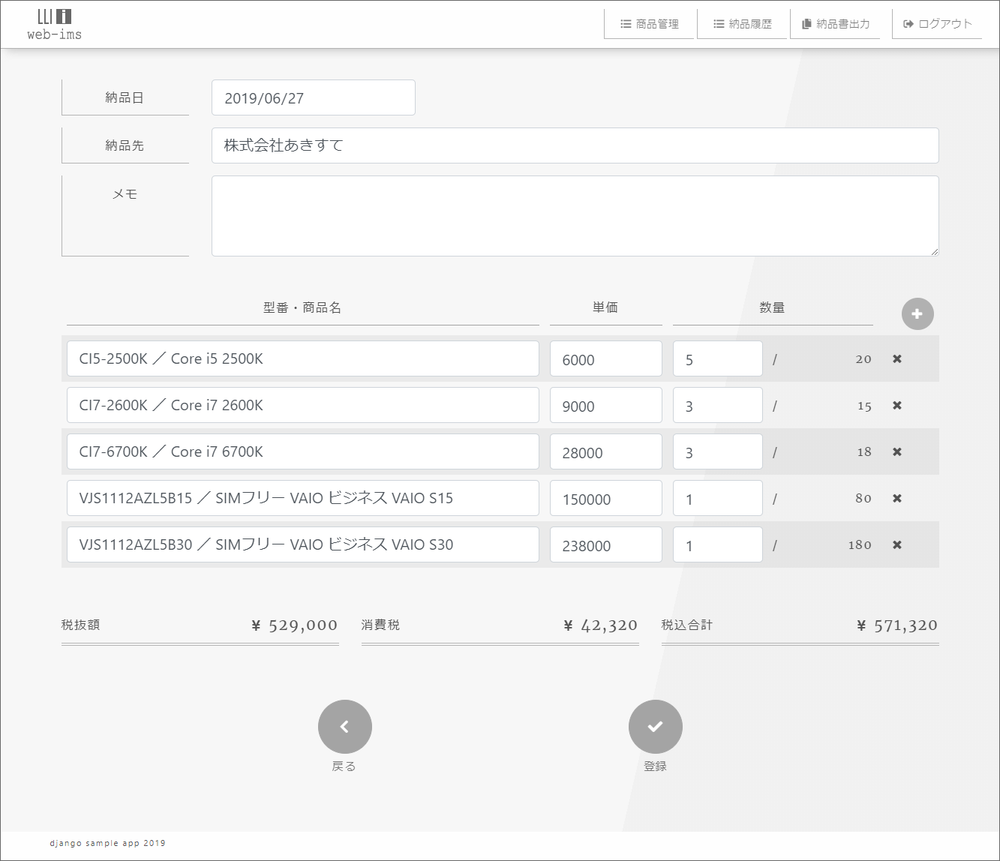

# web-ims（在庫管理WEBアプリ)

## 概要

* 商品の情報、在庫数を記録する。

* 納品履歴を記録する。

* 納品書を出力する。

* モバイル対応。

## 画面サンプル

* ログイン

 

* 在庫一覧

 

* 納品履歴登録

 

* 納品書出力

## 開発環境

* Django 2.1.2, django-allauth 0.39.1, xhtml2pdf 0.2.3

* MySQL

* bootstrap 4.1.3

* Anaconda, Visual Studio Code

## 対応ブラウザ

* Chrome のみ（他のブラウザは動作未検証）

## 参考書

* Python Django 超入門

* 現場で使える Django の教科書《基礎編》

* 現場で使える Django の教科書《実践編》
